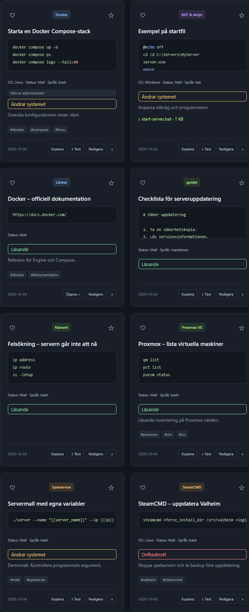
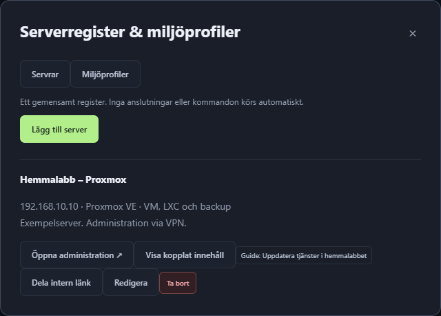
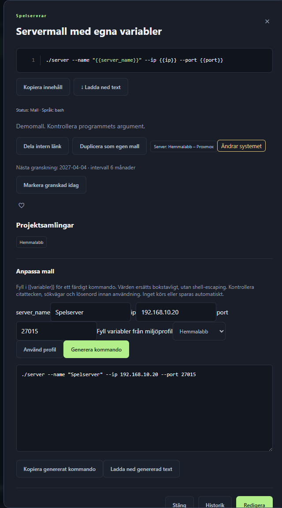
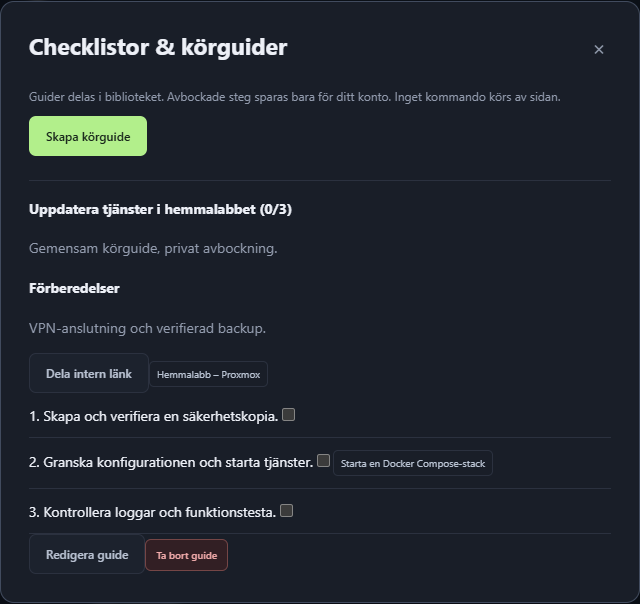

# Användarguide

[Till startsidan](../README.md) · [Installationsguide](INSTALLATION.md)

Prylbanken är ett gemensamt IT-bibliotek. Inga sparade kommandon eller filer
körs automatiskt. Kopiera eller ladda ned dem och granska dem innan körning
på rätt server.

## Börja med färdiga mallar

1. Logga in som administratör eller redigerare.
2. Klicka **Startbibliotek**.
3. Välj de paket du behöver, exempelvis Docker, SteamCMD eller Proxmox.
4. Läs förhandsvisningen och importera.
5. Öppna en post och anpassa sökvägar, portar, programversion och andra värden.

Det finns tio valfria paket med totalt 190 mallar och länkar. De importeras
inte automatiskt vid installation/uppdatering. Att importera samma paket igen
hoppar över redan importerade mallar utan att skriva över dina ändringar.

## Spara egen kod, länk eller fil

1. Klicka **Lägg till nytt**.
2. Ange titel och välj kategori.
3. Klistra in kodtext, eller ange en HTTP/HTTPS-länk i kategorin Länkar.
4. Välj språk, till exempel Bash, BAT, PowerShell, YAML eller Markdown.
5. Lägg till taggar och anteckningar. Ange gärna OS, version, riskklass och testdatum.
6. Välj eventuellt projekt och kopplade servrar.
7. Bifoga en fil om det behövs och spara.

**Kodtext och bilaga är olika saker.** Läs in en UTF-8-textfil i kodfältet
om innehållet ska kunna sökas/redigeras. Bifoga filen om originalfilen ska
lagras för nedladdning. Varje bilaga får vara högst 20 MB.

Öppna postens titel för detaljer. **Kopiera innehåll** kopierar originaltexten;
**Ladda ned text** sparar den som fil. Ett eget nedladdningsnamn kan anges i
redigeringsformuläret. Bilagan har en separat nedladdningslänk.



## Hitta det du sparat

- Välj kategori i sidomenyn eller sök efter ord i biblioteket.
- Kombinera OS, språk, status, taggar, projekt, server och bilagefilter.
- **Bara felsökning** visar strukturerade felsökningsposter.
- **Spara sökning** sparar de aktuella filtren för just ditt konto.
- **Ctrl/Cmd+K** öppnar snabbsök för poster, projekt, guider och servrar.
- **Stjärnan** är en gemensam favorit. **Hjärtat** är din privata favorit.
- Admin kan fästa poster överst. De visas före övriga poster oavsett sortering.

## Serverregister och miljöprofiler

### Registrera en server

1. Öppna **Serverregister & profiler → Servrar**.
2. Välj **Lägg till server**.
3. Fyll i namn, IP/DNS, operativsystem, funktion och eventuell administrationslänk.
4. Spara. Servern kan sedan väljas i post- och guideformulären.

**Visa kopplat innehåll** filtrerar biblioteket till serverns poster.
Registreringen etablerar ingen anslutning till servern och kör inga kommandon.
Om en server tas bort finns poster/guider kvar, men kopplingen tas bort.



### Fyll en mall från en profil

Skriv variabler i kodtexten:

```text
./server --name "{{server_name}}" --ip {{ip}} --port {{port}}
```

1. Öppna **Serverregister & profiler → Miljöprofiler → Lägg till profil**.
2. Ange namn och variabler som ett JSON-objekt, till exempel:

   ```json
   {
     "server_name": "Spelserver",
     "ip": "192.168.10.20",
     "port": "27015"
   }
   ```

3. Öppna mallposten och välj profilen under **Anpassa mall**.
4. Klicka **Använd profil**, granska värdena och välj **Generera kommando**.
5. Kopiera eller ladda ned det genererade resultatet.

Värden ersätts bokstavligt, utan shell-escaping. Kontrollera citattecken och
argument. Profiler delas med alla konton: **inga lösenord, API-nycklar eller
token får sparas där**. Variabelnamnsfiltret är inte en garanti mot hemligheter.



## Guider, checklistor och felsökning

**Checklistor & guider → Skapa körguide** skapar en gemensam instruktion.
Ange förberedelser, ordnade steg, serverkopplingar och eventuella länkar till
biblioteksposter. Alla kan bocka av steg; kryssen sparas privat per konto.
Ändrade instruktioner/länkar eller serverkopplingar kan nollställa avbockningar.



För en felsökningspost: välj **Felsökningspost** under Posttyp och fyll i
symptom, lösning/vad som provades och datum. Koppla servern och relevanta kommandon
så att nästa felsökning börjar med tidigare erfarenheter.

## Dela och återanvänd

- **Dela intern länk** ger en direktlänk till en post, guide, server eller ett
  projekt. Mottagaren behöver nät/VPN och ett konto. Ingen ny behörighet ges.
- **Duplicera som egen mall** skapar en fristående kopia och öppnar den för
  redigering. Originalet ändras inte. Fästmarkering och tidigare historik kopieras inte.
- **Projektsamlingar** grupperar poster oavsett kategori. En post kan ingå i flera projekt.
- Projekt kan laddas ned som ZIP med originaltext, bilagor och biblioteks-JSON.
  Full JSON-export omfattar även guider, serverregister och profiler, men inte konton.

## Importera större mängder

| Källa | Gör så här | Gräns / beteende |
| --- | --- | --- |
| Kodtext eller bilagor | **Flera filer**, välj/dra filer och granska före import | 1–50 filer, sammanlagt 20 MB; UTF-8-kodtext högst 200 kB per fil |
| En mapp | **Flera filer → Välj mapp med filer** | Samma gränser; relativa källsökvägen sparas i anteckningar |
| Webbläsarbokmärken | Exportera HTML från webbläsaren, välj **Importera bokmärken** | UTF-8, högst 2 MB/5000 länkar; importera 1–50 åt gången |
| Prylbanken-export | **Importera**, välj biblioteks-JSON | Lägger till, behåller befintliga poster; högst 5000 poster/29 MB |

Granska titlar, kategori och urval i förhandsvisningen. Fil-/bokmärkesimport
hoppar som standard över identiskt innehåll. Vanlig biblioteks-JSON-import kan
däremot skapa dubbletter vid upprepning. Full SQLite-återställning är en annan
funktion och ersätter databasen.

## Administrera biblioteket

- **Användare:** skapa konton, välj roller, inaktivera konton och återställ lösenord.
  Nya självregistrerade konton är **läsare**. Roller ändras av admin.
- **Administration:** stäng registrering, hantera fulla backuper, öppna
  lagringsöversikten och aktivera valfri publik länkkontroll.
- **Kontrollera publik länk:** tillgänglig för redigerare/admin när admin har
  aktiverat funktionen. Kontrollerar endast publika HTTP/HTTPS-adresser.
  Lokala, interna och VPN-adresser nekas. Funktionen är manuell, inte schemalagd.
- **Historik:** jämför versioner och återställ en tidigare version.
- **Papperskorg:** återställ en borttagen post. Endast admin kan radera permanent.
- **Granskning:** markera en post granskad för att flytta nästa påminnelse.
  Det intygar inte att kommandot har körtestats.

Alla roller kan läsa det gemensamma biblioteket och ladda ned dess filer.
Innehåll är inte privat bara för att länken delas med en person.

## Installera på hemskärmen

Välj **Installera app** eller webbläsarens installationsmeny. På iPhone:
Safari → Dela → Lägg till på hemskärmen. HTTPS/localhost och webbläsarstöd krävs.
Appen behöver fortfarande nät/VPN och har ingen offline-cache av biblioteket.

## Viktiga vanor

1. Granska alltid kommandon och rätt server innan körning.
2. Ladda regelbundet ned en full backup till en annan enhet.
3. Spara inte hemligheter i gemensamma profiler eller demoexempel.
4. Logga ut på delade datorer.
5. Exponera inte webbporten publikt för den avsedda VPN-installationen.

Bilderna visar en separat demoinstallation med exempelposter och påhittade
adresser. För fler detaljer och exakta gränser, se [README](../README.md).
