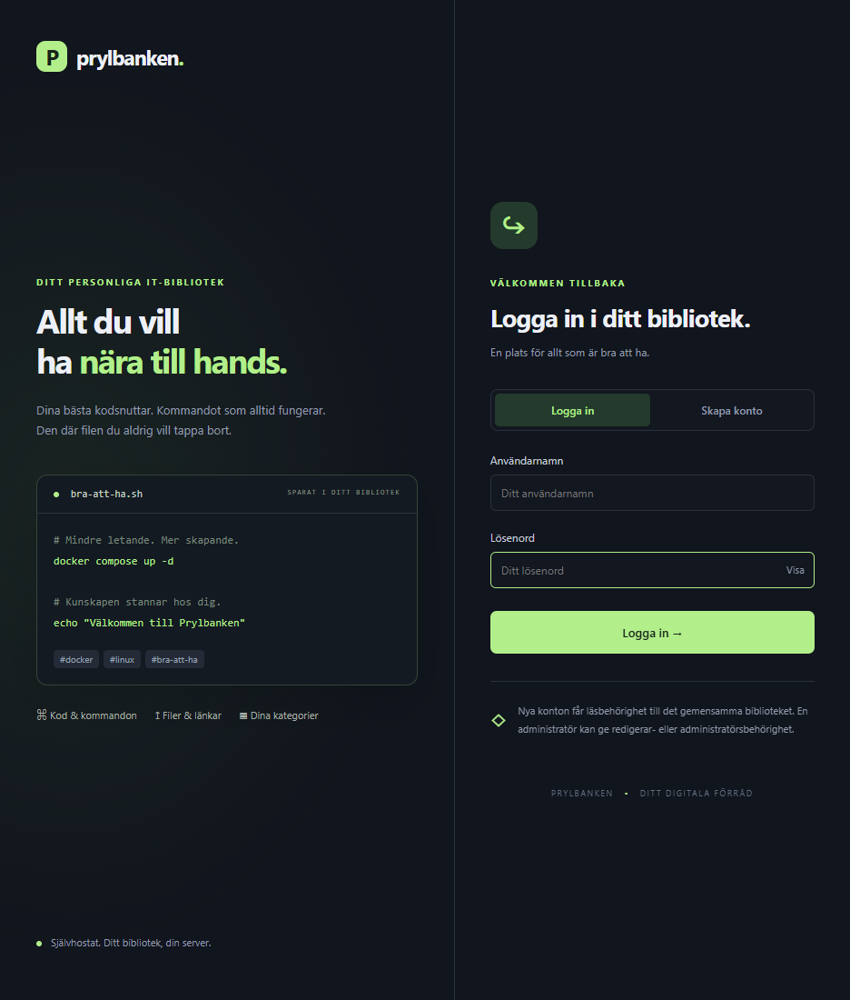

# Installation, uppdatering och felsökning

[Till startsidan](../README.md) · [Användarguide](ANVANDNING.md)

Guiden gäller en Linux Docker-host på ett betrott LAN eller bakom VPN.
Prylbanken installerar inte Docker, Git, VPN eller brandväggsregler åt dig.

## 1. Kontrollera förutsättningarna

Öppna serverns terminal, exempelvis via SSH. Kör:

```sh
docker info
docker compose version
git --version
```

Alla tre kommandon ska fungera. Compose måste stödja `up --wait`; uppdatera
Compose-pluginen om den är för gammal. Använd Docker-installationsanvisningarna
för ditt operativsystem om något saknas:
[Docker Engine](https://docs.docker.com/engine/install/) och
[Compose-pluginen](https://docs.docker.com/compose/install/linux/).

Om `docker info` ger ett behörighetsfel: använd ett konto med avsedd
Docker-behörighet enligt din hosts policy. Docker-behörighet är kraftfull och
motsvarar i praktiken administratörsåtkomst till värden.

## 2. Hämta och installera

Kör i en mapp där du vill behålla installationens källkod och inställningar:

```sh
git clone https://github.com/richardstenlund/prylbanken.git
cd prylbanken
sh install.sh
```

Första gången skapar skriptet:

- `.env` med ett slumpmässigt adminlösenord och port 8080.
- En container byggd från projektets Dockerfile.
- En datavolym och en separat backupvolym.

Skriptet väntar på hälsokontrollen. Först när den är godkänd visas att
installationen är klar. Spara lösenordet på en säker plats.

**Har du redan projektet?** Klona inte en ny kopia. Följ uppdateringsavsnittet
nedan i den befintliga installationsmappen.

## 3. Öppna och verifiera

```sh
hostname -I
docker compose ps
curl -fsS http://127.0.0.1:8080/api/health
```

Containern ska vara igång och hälsokontrollen ska svara med `{"ok": true}`.
Om du har bytt port använder du den porten i curl-kommandot.

Öppna `http://SERVERNS-IP:8080` från en enhet på ditt LAN/VPN.
`SERVERNS-IP` är en platshållare, inte en bokstavlig adress.
Logga in med användarnamnet **admin** och det skapade lösenordet.



Byt därefter lösenord via **Användare → Byt ditt lösenord**.
`APP_PASSWORD` i `.env` används för att skapa det första adminkontot; att ändra
det senare återställer inte lösenordet för ett befintligt konto.

## 4. Nätverk, port och HTTPS

Installeraren väljer `BIND_ADDRESS=0.0.0.0` och `APP_PORT=8080` för LAN-åtkomst.
Det betyder alla värdens nätverksgränssnitt, inte bara VPN. Begränsa åtkomsten
med din nätverks-/brandväggskonfiguration och öppna inte porten i routern.
Docker-publicerade portar kan påverka hur värdens brandväggsregler tillämpas:
verifiera att porten inte går att nå från obetrodda nät.

HTTP krypterar inte trafiken. För HTTPS använder du en egen reverse proxy
och ett giltigt certifikat. Sätt `COOKIE_SECURE=true` i `.env` när åtkomsten
sker via HTTPS. Slå inte på det vid en vanlig HTTP-installation eftersom
webbläsaren då inte skickar sessionscookien över HTTP.

### Byta port

Redigera den befintliga `.env`, till exempel med:

```sh
nano .env
```

Ändra portvärdet utan att radera lösenordet eller övriga inställningar:

```dotenv
APP_PORT=8081
```

Kör `sh install.sh` igen och öppna `http://SERVERNS-IP:8081`.
För åtkomst bara från Docker-värden/reverse proxy kan du välja
`BIND_ADDRESS=127.0.0.1`. Andra enheter kan då inte nå den publicerade porten direkt.

**Dela aldrig `.env` eller terminalutskrifter med lösenord.**

## 5. Uppdatera en befintlig installation

1. Logga in som admin.
2. Öppna **Administration → Skapa säkerhetskopia nu**.
3. Ladda ned kopian och förvara den utanför Docker-värden.
4. Kör i samma installationsmapp som tidigare:

   ```sh
   cd prylbanken
   git pull --ff-only && sh install.sh
   docker compose ps
   ```

Om du redan står i installationsmappen behövs inte `cd prylbanken`.
Installeraren bevarar `.env` och volymerna. Schemat migreras vid start;
poster, bilagor och konton behålls. Ladda om webbläsaren efter uppdateringen.

Om Git rapporterar lokala ändringar eller att uppdateringen inte kan ske
med fast-forward: lös det uttryckligen först. Använd inte en tvingad reset
som genväg och ta inte bort dina inställningar.

## 6. Daglig drift

Kör alla Compose-kommandon i installationsmappen:

| Åtgärd | Kommando |
| --- | --- |
| Visa status | `docker compose ps` |
| Läs senaste loggar | `docker compose logs --tail=100` |
| Följ loggar | `docker compose logs -f --tail=100` |
| Stoppa tillfälligt | `docker compose stop` |
| Starta igen | `docker compose start` |
| Ta bort containern, behåll volymer | `docker compose down` |
| Bygg och starta igen | `sh install.sh` |

**Kör inte `docker compose down -v` om du vill behålla data.**
Flaggan `-v` raderar projektets namngivna volymer, inklusive backuper.

## 7. Backup och återställning

Dagliga fullständiga SQLite-backuper sparas i en separat Docker-volym.
14 kopior behålls per typ: daglig, manuell och före full återställning.
En volym på samma host är inte ett skydd mot att hela disken/värden försvinner.

- **Full backup:** Administration → Skapa säkerhetskopia nu → Ladda ned.
  Innehåller även konton, inställningar och privat användarstatus.
- **Full återställning:** Administration → välj kopia → Full återställning.
  Ersätter databasen och loggar ut alla. Logga sedan in med ett konto som
  fanns i kopian. En säkerhetskopia av nuläget tas först.
- **Exportera/Importera JSON:** överför bibliotekets innehåll, inte konton.
  Import lägger till poster och ersätter inte hela installationen.
- Säkerhetskopiera `.env` separat. Den ingår inte i databasbackupen.

Läs [detaljer om backup](../README.md#säkerhetskopiering-och-återställning)
och [valfri NAS-backup](../README.md#automatisk-backup-till-nas).

## Felsökning

| Problem | Kontrollera / åtgärda |
| --- | --- |
| Docker eller Compose saknas | Installera Engine och Compose v2; kör förkontrollerna igen. |
| `--wait` stöds inte | Uppdatera Compose-pluginen. |
| Port 8080 används redan | Ändra `APP_PORT` i `.env` och kör `sh install.sh`. |
| Installationen misslyckas | Läs `docker compose logs --tail=100`; åtgärda felet och kör installeraren igen. Befintliga data lämnas kvar. |
| Sidan nås lokalt men inte via VPN | Kontrollera rätt IP/port, `BIND_ADDRESS`, VPN-rutt och brandvägg. |
| Inloggningen fungerar inte över HTTP | Kontrollera att `COOKIE_SECURE` inte är `true` för en HTTP-installation. |
| Ändrat `.env`-lösenord hjälper inte | Befintliga kontolösenord ändras i webbgränssnittet, inte via `APP_PASSWORD`. |
| Nya knappar saknas efter uppdatering | Kontrollera att bygget/starten lyckades, ladda sedan om sidan utan cache. Kontrollera också användarens roll. |
| Länkkontroll är avstängd | Admin aktiverar den under Administration. Interna/VPN-adresser nekas även efter aktivering. |
| Appinstallation erbjuds inte | HTTPS eller localhost och webbläsarstöd krävs. HTTP till en privat IP räcker vanligtvis inte. |
| NAS-backup ger fel | Kontrollera montering, markörfil och rättigheter; se NAS-guiden. Den lokala backupen behålls. |

Vid fel: dela bara relevanta loggrader efter att ha maskerat lösenord, token
och privata uppgifter. Dokumentationen visar installationens avsedda beteende;
verifiera containerstart och nätverksåtkomst på din egen host.
